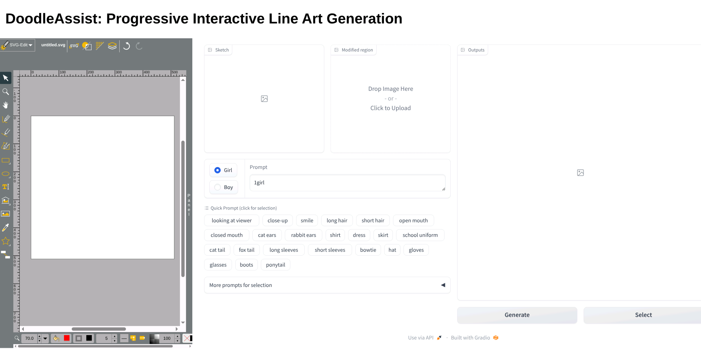
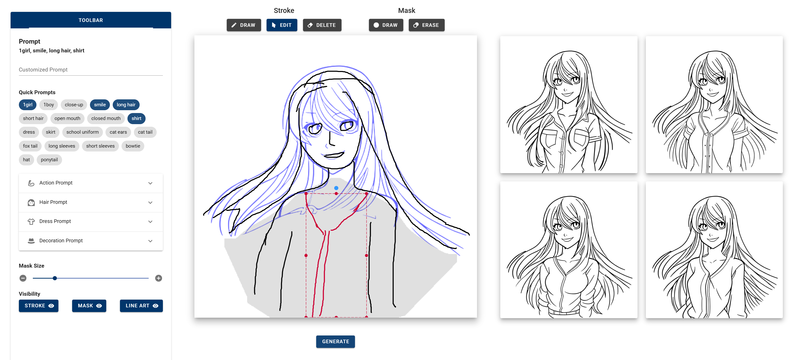

# DoodleAssist: Progressive Interactive Line Art Generation with Latent Distribution Alignment - TVCG 2025

[[Paper]](https://cislab.hkust-gz.edu.cn/media/documents/TVCG_DoodleAssist_final.pdf) | [[Paper (IEEE)]](https://ieeexplore.ieee.org/abstract/document/11216020) | [[Project Page]](https://markmohr.github.io/DoodleAssist/)

*DoodleAssist* is an interactive and progressive line art generation system controlled by sketches and prompts, which helps both experts and novices concretize their design intentions or explore possibilities.


## Outline

- [Setup](#setup)
- [Gradio UI (Single-GPU)](#gradio-ui-single-gpu)
- [Web UI (Multi-GPU)](#web-ui-multi-gpu)
- [Citation](#citation)

## Setup

### 1. Install Environment via Anaconda (Recommended)
```bash
conda create -n doodleassist python==3.10.15
conda activate doodleassist
pip install -r requirements.txt
```

### 2. Model Preparation

- Checkpoint

    - Download the checkpoint `controlnext-48000.bin` (13MB) [here](https://drive.google.com/file/d/1auWNemiIeChDxkUfPoGLBqdiF9AZhFM-/view?usp=sharing), and place it to `./checkpoint/controlnext-48000.bin`.


- Base model

    - We use a Stable Diffusion 1.5 model fine-tuned on line art data on civitai.com. Download it (`foolkatGODOF_v3.safetensors`) [here](https://civitai.com/models/123631?modelVersionId=142306).
    - Convert the safetensors to diffusers models using the following commands (they are placed in `./backbone/foolkatGODOF_v3/`):
```bash
git clone https://github.com/huggingface/diffusers.git
cd diffusers
python scripts/convert_original_stable_diffusion_to_diffusers.py \
  --checkpoint_path your/path/to/foolkatGODOF_v3.safetensors \
  --dump_path your/path/to/DoodleAssist/backbone/foolkatGODOF_v3/ \
  --from_safetensors
```


## Gradio UI (Single-GPU)

To deploy the interface without the need for installing a web development environment, we provide a Gradio demo. It integrates an SVG editor ([SVG-edit](https://edit.svgomg.net/)) and our processing interface. 

It requires **~13GB** of GPU memory and can be deployed on a single NVIDIA 4090 GPU.



### Linux Users

Use the following command:
```bash
python gradio_app.py
```

Then, open the `gradio_interface/app.html` in the browser. Please use **Google Chrome**. 

Refer to the tutorial [here](docs/Gradio_Operations.md) for instructions on using the interface.

### Windows Users

Please select a directory for placing the outputs first. Then, use the following command:
```bash
python gradio_app.py --data_base your/selected/directory
```

Afterwards, open the `gradio_interface/app.html` in the browser. Remember to save the SVG as `untitled.svg` to that selected directory.

Refer to the tutorial [here](docs/Gradio_Operations.md) for instructions on using the interface.


## Web UI (Multi-GPU)

We also provide a web interface, which is deployed on 4 NVIDIA 4090 GPUs.




Use the following commands one by one to set up backend servers on each GPU:
```bash
CUDA_VISIBLE_DEVICES=0 python web_app_server.py --port=9000
CUDA_VISIBLE_DEVICES=1 python web_app_server.py --port=9001
CUDA_VISIBLE_DEVICES=2 python web_app_server.py --port=9002
CUDA_VISIBLE_DEVICES=3 python web_app_server.py --port=9003
```

Make sure to install the nodejs and npm environments first (ask AI :smile:). Then, set up the frontend web UI (Vue 2) using the following commands:
```bash
cd web_interface/
npm install
npm run serve
```

Afterwards, open [http://localhost:8080/](http://localhost:8080/) in any browser.

Refer to the [video](https://youtu.be/7qbFfR3f8fY?t=45) for instructions on using the interface.


## Citation

If you use the code and models, please cite:

```bib
@article{mo2025doodleassist,
  title={DoodleAssist: Progressive Interactive Line Art Generation with Latent Distribution Alignment},
  author={Mo, Haoran and Shen, Yulin and Simo-Serra, Edgar and Wang, Zeyu},
  journal={IEEE Transactions on Visualization and Computer Graphics},
  year={2025},
  publisher={IEEE}
}
```

## Acknowledgements

This work is built based on [ControlNeXt](https://github.com/JIA-Lab-research/ControlNeXt) and the dataset [SketchMan](https://github.com/LCXCUC/SketchMan2020). We would like to thank their authors.

