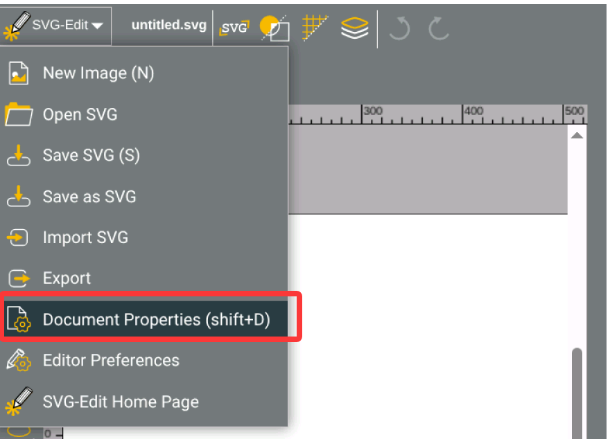
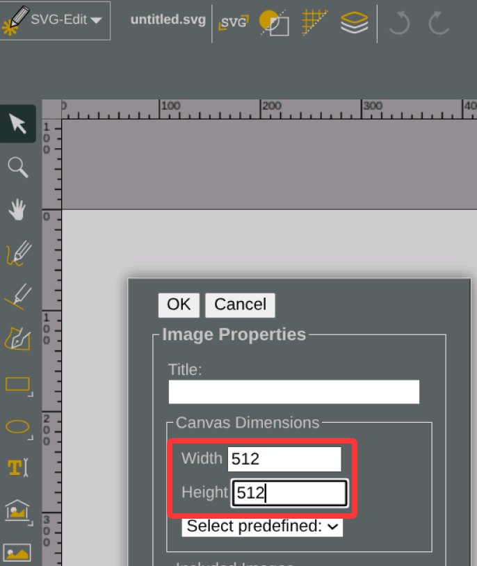
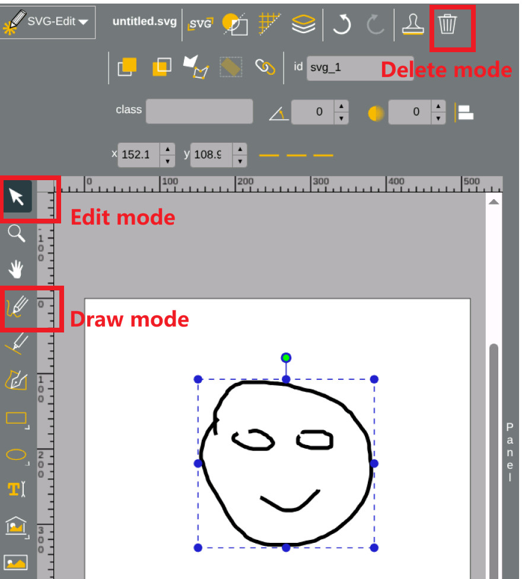
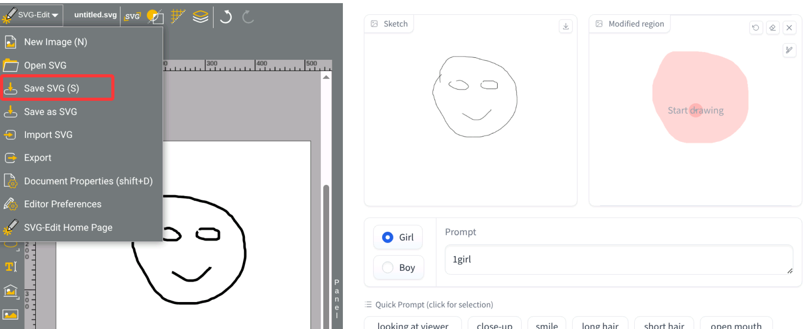
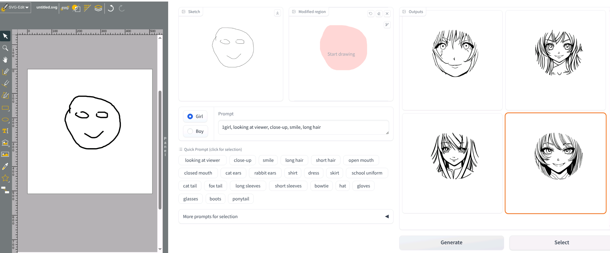
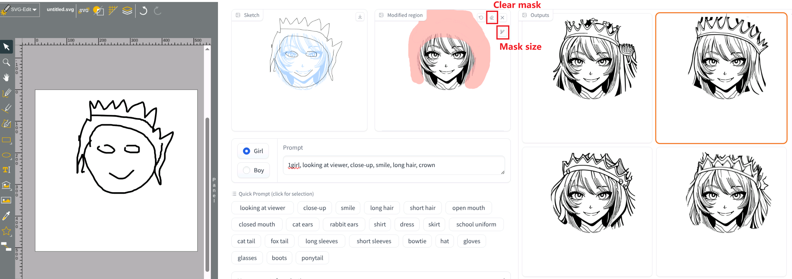

# How to use the interface

1. Set the document property. Set the canvas size to 512*512.

2. Choose the draw/edit/delete mode, and create your sketch!

3. Save the SVG. The sketch and its corresponding automatically computed mask will be displayed on the right immediately.

4. Input the prompts by typing or selecting the quick prompts. After the generation, you can select one.

5. Adjust the mask region if you want. You can draw it directly. There are tools for undo, clearing the mask, and adjusting the mask size.

